# Nagare — algorithms, flowcharts, and system architecture (article figures)

Source diagrams for the Nagare framework (`holonomy_learn`). Each is provided as Mermaid (renders in most
venues); the two architecture figures also have TikZ under `docs/article/tikz/`. Nagare is closed-form and
FD-verified with **no autograd**; that discipline is the substrate every figure sits on.

---

## Fig. 0 — The whole Nagare pipeline (end-to-end)

The unified flow: any input domain enters the closed-form op library, ops compose into a model, the model is
learned by one of **two regimes** (backprop *or* evolvent), evaluation feeds outputs, and the assimilation loop
integrates each result back into the framework.

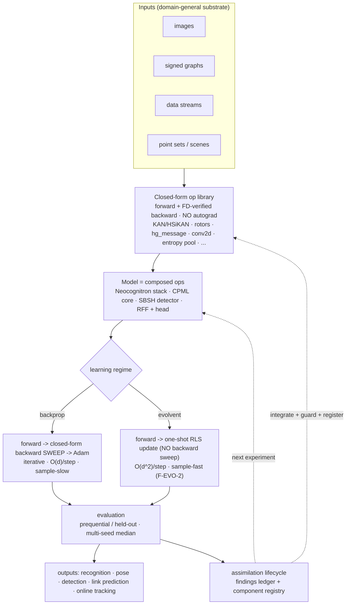

---

## Fig. 1 — System architecture (layered)

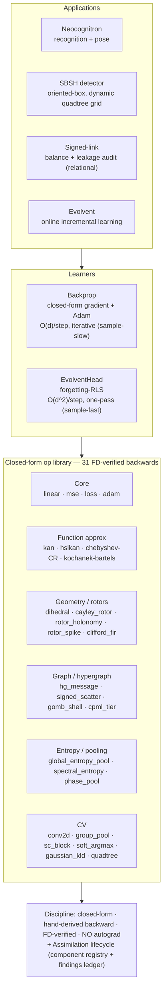

---

## Fig. 2 — The closed-form op contract (per-op, no autograd)

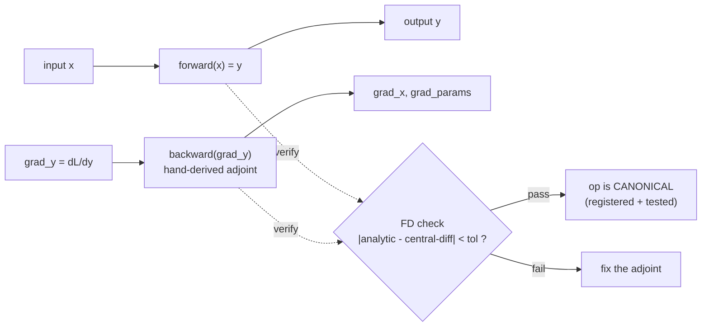

---

## Fig. 3 — Neocognitron pipeline (S/C hierarchy + entropy top)

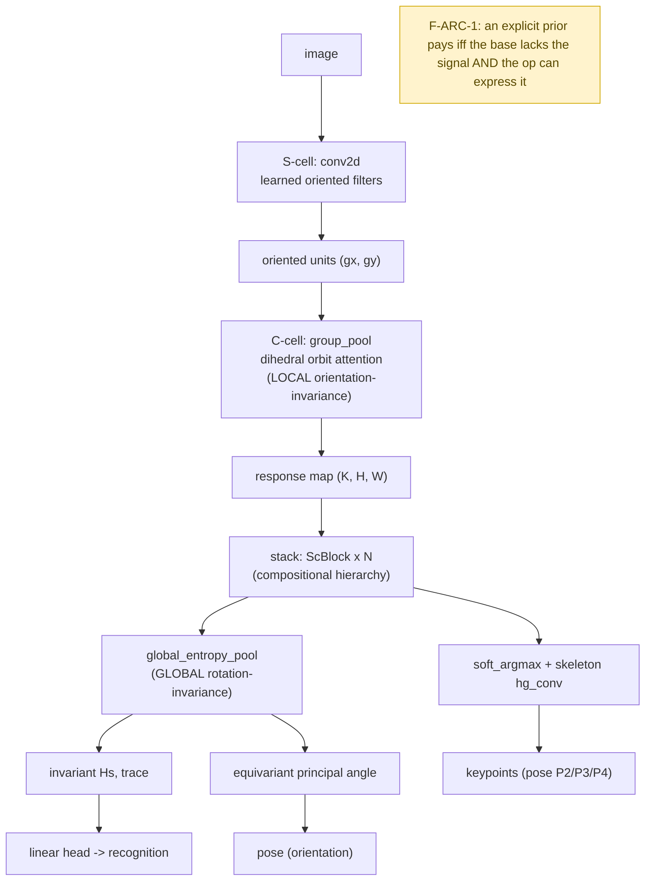

---

## Fig. 4 — Entropy global pool (one covariance → invariant recognition + equivariant pose)

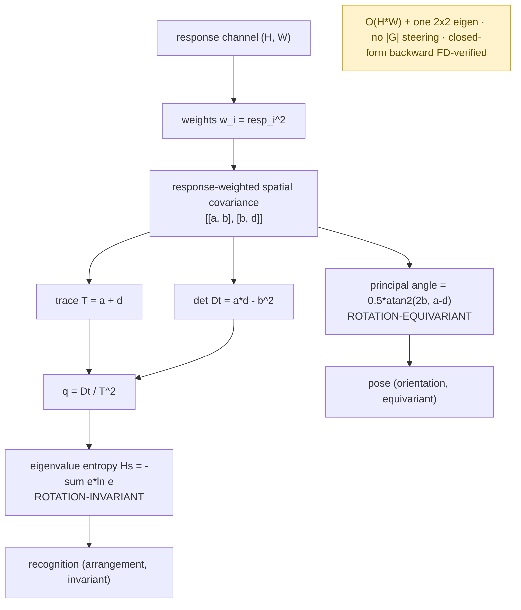

---

## Fig. 5 — Evolvent update (forgetting-RLS online learning loop)

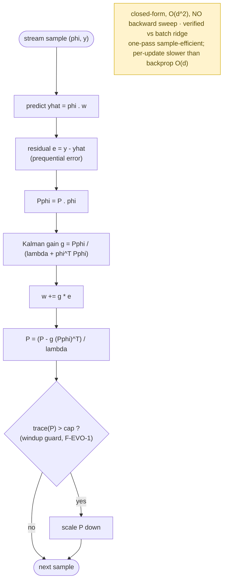

---

## Fig. 6 — Signed-link balance & leakage audit (relational)

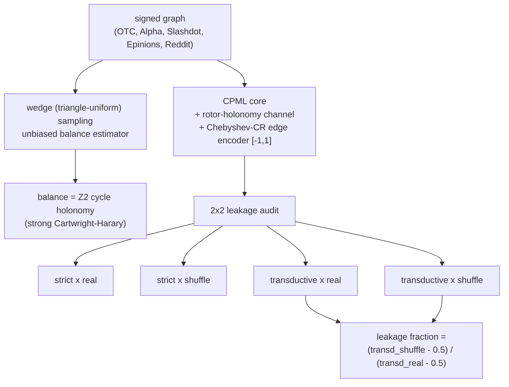

---

## Fig. 7 — SBSH detector (closed-form YOLO alternative)

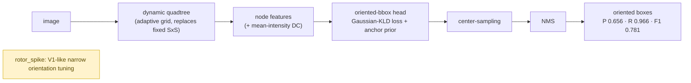

---

## Fig. 8 — Assimilation lifecycle (framework governance)

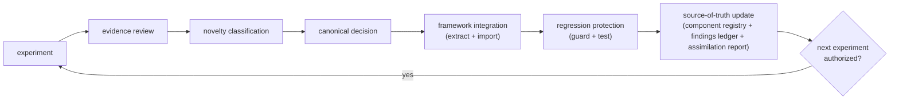

---

## Fig. 9 — HSiKAN structural-leverage (signed KAN + causal double-dissociation)

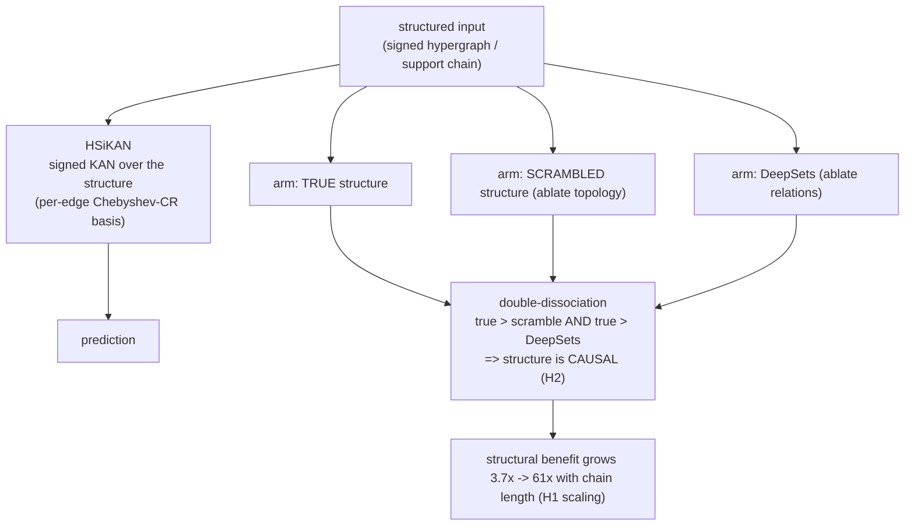

### Fig. 9a — HSiKAN experimental design (falsification protocol)

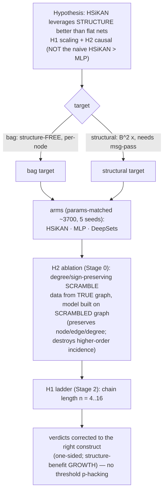

### Fig. 9b — the double-dissociation (what each ablation removes)

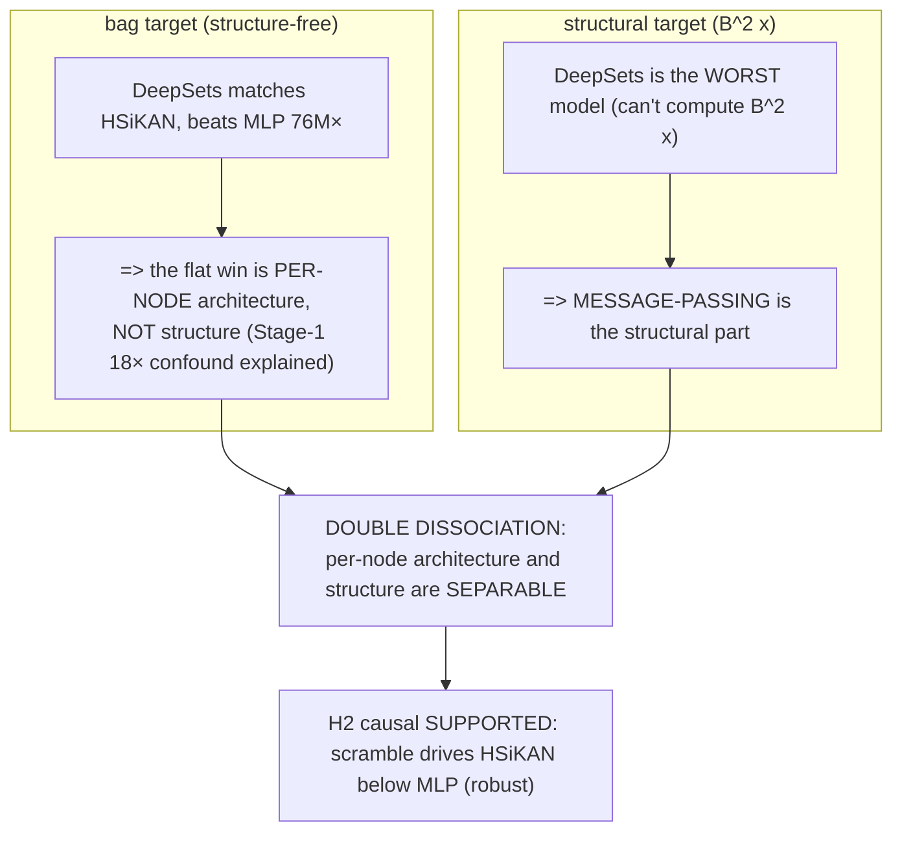

### Fig. 9c — H1 scaling (measured, 5 seeds)

Real result plot: `svg/fig9c-hsikan-scaling.png` (from `data/hsikan_ladder.json`). Left: per-model test error
(median ± IQR) vs chain length — HSiKAN·true stays low and flat (~0.001–0.005) while scramble/MLP degrade with
depth; DeepSets stuck (~0.14–0.19). Right: the scramble-isolated structure-benefit ratio grows monotonically
**3.7× → 11× → 15× → 62× → 61×**.

| n | HSiKAN·true | HSiKAN·scr | DeepSets | MLP | benefit (scr/true) | MLP/HK |
|---|---|---|---|---|---|---|
| 4 | 0.0008 | 0.0030 | 0.098 | 0.0033 | **3.7×** | 4.1× |
| 6 | 0.0044 | 0.0487 | 0.189 | 0.0178 | **11.0×** | 4.0× |
| 8 | 0.0054 | 0.0838 | 0.141 | 0.0415 | **15.4×** | 7.6× |
| 12 | 0.0044 | 0.271 | 0.170 | 0.0975 | **61.7×** | 22.2× |
| 16 | 0.0035 | 0.213 | 0.140 | 0.111 | **60.9×** | 31.6× |

---

## Fig. 10 — CV rotation-invariant texture descriptor (phase_pool / dihedral)

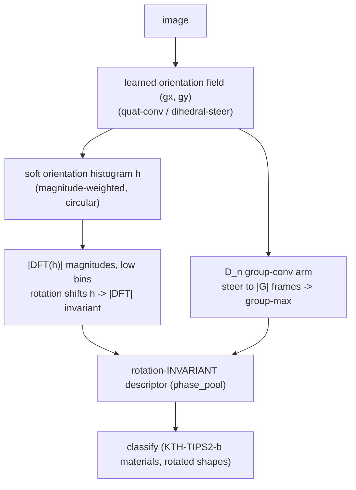

---

## Fig. 11 — Rotor & holonomy geometry primitives

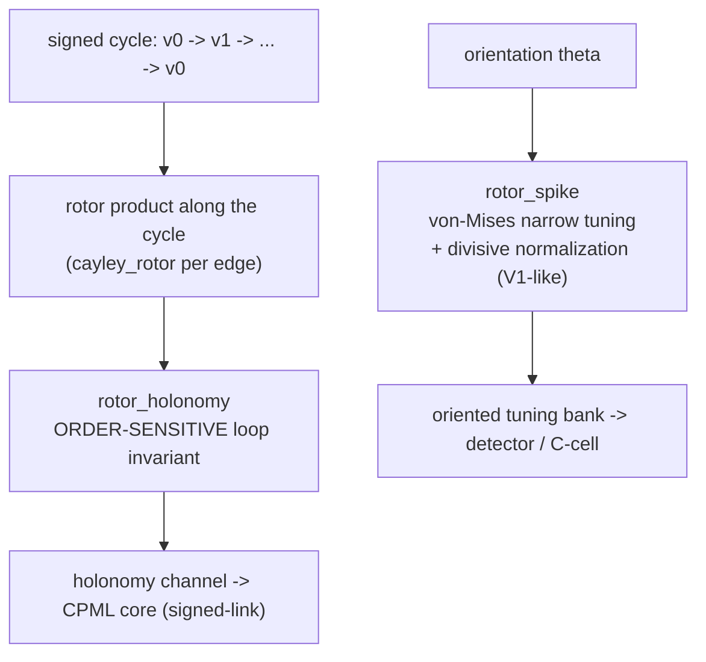

---

## Fig. 12 — KAN / HSiKAN learnable spline op (Chebyshev-CR)

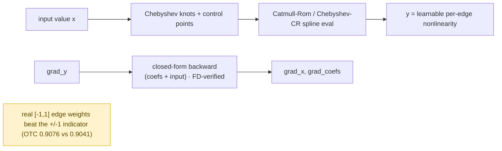

---

## Fig. 13 — Scatter-locality (systems / performance)

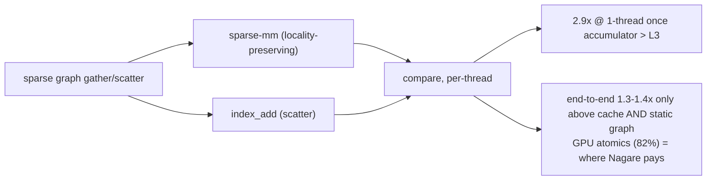
