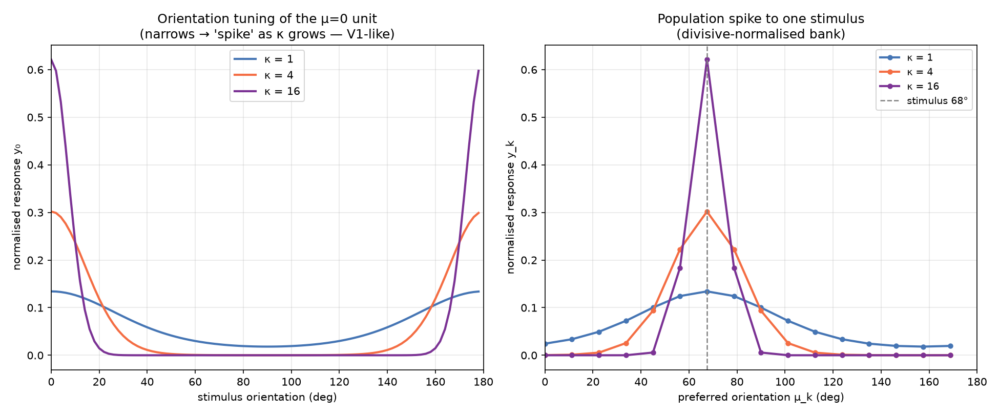

# SBSH Phase 5 — the `rotor_spike` op

Date: 2026-07-13 · Mac (Apple Silicon) · Nagare at `2842ead`+ · CPU

## Summary

A closed-form, FD-verified **narrow orientation-tuning op** modelled on biological visual neurons. Nagare's
existing orientation features (`phase_pool`, `oriented_descriptor`) use *broad* soft-histograms; `rotor_spike`
adds a bank of `K` orientation-selective units, each tuned to a preferred orientation `μ_k = πk/K` with a
**von-Mises concentration `κ` that sets the tuning width** — large `κ` ⇒ a narrow *spike* (V1 simple-cell
selectivity), small `κ` ⇒ broad. A divisive normalisation (Carandini–Heeger gain control) sparsifies the bank
into a peaked orientation distribution — the "rotor spike".

Figure 1 shows the textbook result directly: as `κ` grows, the μ=0 unit's tuning curve narrows from nearly
flat (`κ=1`) to a sharp spike (`κ=16`), and the population response to a fixed stimulus sharpens onto the
stimulus orientation. The op is exact and hand-differentiated; the **FD backward passed on the first try**.

## The op — math

Input a per-pixel field `(gx,gy)` (`n` samples × `np` pixels, interleaved — the `phase_pool` layout). Per
pixel `m=‖(gx,gy)‖`, `θ=atan2(gy,gx)` (skip `m<ε`); with `φ_pk = 2θ_p − 2μ_k`:

```
e_{s,k} = Σ_p m_p · exp(κ(cos φ_pk − 1))     (shifted: overflow-safe, in (0,1])
Z_s     = ε_Z + Σ_k e_{s,k}
y_{s,k} = e_{s,k} / Z_s                       (the normalised spike)
```

The doubled angle `2θ` makes it **orientation**-selective (period π, not direction). The `−1` shift factors
`exp(−κ)` out of every term (overflow-safe); it cancels in the ratio `y`.

**Backward** (hand-derived, FD-verified): the normaliser is softmax-like,
`∂y_k/∂e_j = δ_kj/Z − e_k/Z²`, so `ē_j = ȳ_j/Z − (Σ_k ȳ_k e_k)/Z²`. The tuning bank gives
`∂e_k/∂m = exp(κ(cosφ−1))` and `∂e_k/∂θ = −2κ·m·exp(κ(cosφ−1))·sinφ`, chained through
`∂m/∂(gx,gy)=(gx,gy)/m`, `∂θ/∂(gx,gy)=(−gy,gx)/m²`. Guards: `m<ε` pixels contribute zero gradient (an
isotropic pixel has no orientation — intended sparsity, not a defect); `Z` floored by `ε_Z`.

## Figure



**Figure 1.** Left: orientation tuning of the μ=0 unit as the stimulus orientation sweeps 0→180°; `κ=1`
broad, `κ=4` moderate, `κ=16` a sharp spike (peaks at 0° and 180° — the period-π orientation equivalence).
Right: the divisively-normalised population bank's response to a single 68° stimulus sharpens onto the
stimulus as `κ` grows. This is the classical V1 orientation-tuning behaviour, produced by a closed-form op
with an exact backward. Regenerate: `cargo run --release --example rotor_spike_tuning -- <json>` then
`python scripts/dev/render_rotor_spike.py …`.

## Tests

| layer | test | result |
|---|---|---|
| unit (FD) | `rotor_spike::backward_matches_fd` | ok — directional-derivative of `grad_field`, tol 2% (passed first try) |
| unit | `rotor_spike::narrower_with_kappa` | ok — spike entropy strictly decreases as `κ` grows (the biological narrowing) |
| unit | `rotor_spike::peak_at_stimulus_orientation` | ok — argmax bin = stimulus orientation; π/2 rotation shifts peak by K/2 (period π) |
| unit | `rotor_spike::isotropic_flat_and_finite` | ok — all-orientation input → near-uniform, finite; backward finite |
| full suite | `cargo test --release` | **145 passed / 0 failed** (+4) |
| gate | `cargo fmt --check`, `cargo clippy --all-targets -D warnings` | clean |

## Files touched

| file | change |
|---|---|
| `src/ops/rotor_spike.rs` | new op — `rotor_spike_forward/backward`, `rotor_spike_dim`, `RotorSpikeOut` + 4 tests |
| `src/ops/mod.rs`, `src/lib.rs` | register + re-export |
| `examples/rotor_spike_tuning.rs` | tuning-curve demo → JSON |
| `scripts/dev/render_rotor_spike.py` | renderer (tuning curves + population spike) |

No new deps, no CORE.YAML. Plan bundle: `docs/plans/2026-07-13-rotor-spike/` (gitignored, PDF built).

## Prior art / positioning

von-Mises / Gabor orientation tuning and divisive normalisation are classical V1 models (Hubel & Wiesel;
Carandini & Heeger). Steerable filters (Freeman & Adelson 1991) and LIFT's canonical orientation are the
differentiable-orientation neighbours. **No novelty is claimed for the tuning model.** The contribution is a
*closed-form, hand-derived, FD-verified* orientation-tuning op with a divisive-normalised spike output, in the
no-autograd Nagare discipline, composable with the SBSH descriptor. Bounded Phase-0 search found no
von-Mises/spiking op in the crate (`fsr_mixer`'s "spike" is top-k routing, unrelated); not an exhaustive
neuro-CV sweep.

## Integration status & next

The op is built, FD-clean, and demonstrated. It is **not yet wired into the detector's default descriptor
stage** — swapping/augmenting `oriented_descriptor` with the spike bank changes the model, and per §6.5 #19 a
model-changing default flip is gated on an A/B verdict, not convenience. The next step is exactly that A/B:

1. **A/B the rotor-spike vs the broad histogram** as the detector's orientation feature (does the sharper,
   sparser code improve objectness/orientation on the synthetic scenes, and later on a real slice?). Default
   only on a measured win.
2. **Phase 6** — the learned feature stem (`oriented_descriptor_backward` + `node_pool_backward`) and
   `hg_message` inter-leaf context (the size-observability fix from Phase 4). The rotor-spike is a natural
   sparse front-end for a learned stem — `κ` can become a learnable per-unit tuning width.

## Provenance

- Mac (Apple Silicon), Nagare `2842ead`+; CPU. No GPU, no data (analytic tuning stimuli).
- Reproduce: `cargo test --release rotor_spike` and `cargo run --release --example rotor_spike_tuning`.
