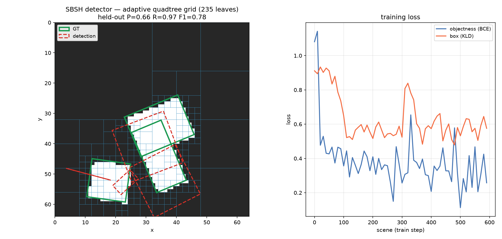

# SBSH Phase 4 — the hypergraph-grid forward detector

Date: 2026-07-13 · Mac (Apple Silicon) · Nagare at `7a15c4f`+ · CPU

## Summary

A working **forward oriented-object detector whose detection grid is a dynamic quadtree** — the adaptive,
data-driven alternative to YOLO's fixed `S×S` grid. Leaves subdivide only where there is content (gradient
energy), so the "grid cells" are fine on objects and coarse on background (visible in Figure 1: 235 leaves
concentrate on the 3 objects). Each leaf is a node of the SBSH spatial hypergraph; the message-passing
enrichment over hyperedges (`hg_message`) is a later phase.

The detector composes **already-FD-verified ops** and introduces **no new closed-form backward**: the
trainable part is a single `linear` head over fixed per-leaf features, so its backward is exactly the
(already green) Phase-3 `oriented_head_learn` path plus a BCE branch.

Pipeline: `grad-energy → quadtree_build → per-leaf [oriented_descriptor(crop) ⊕ node_pool means ⊕ geometry]
→ linear head → (objectness logit, box raw₅) → decode(anchor)`. Losses: `bce_with_logits`(objectness) +
`gaussian_kld`(box).

**Result (80 held-out synthetic scenes):** **P = 0.656, R = 0.966, F1 = 0.781**; objectness cleanly
separates centre-region leaves (mean prob **0.819**) from background (**0.171**); detection centres land
**6.4 px** from GT centres. The adaptive grid + objectness *localises* objects well; oriented-**box size** is
only coarsely regressed — an honest representational limit (below).

## The thesis — adaptive grid vs YOLO's fixed grid

YOLO tiles a fixed `S×S` grid; each cell has a fixed box budget at a fixed scale, and the scale/aspect
mismatch is patched with anchors and FPN pyramids. SBSH replaces the grid itself with a quadtree that spends
resolution where the image has structure. Figure 1 shows the payoff directly: the tree is dense on the
objects (where detection needs resolution) and nearly empty on background (where a fixed grid wastes cells).
This is the H1 hinge (validated in the smoke: 3.6× leaf concentration on objects) turned into a detector.

## Honest debugging trail (five diagnosed issues, each a measured fix — not a guess)

This phase's value is as much in *what failed and why* as in the final number. Each fix was a discriminating
test, not a tweak:

1. **Coverage-objectness can't see filled interiors.** First objectness target = "leaf covers an object"
   (pixel fraction). Separation was 0.54 vs 0.45 — near chance. Cause: the features were edge-centric
   (descriptor + gradient), but a flat object *interior* leaf has zero gradient — indistinguishable from
   flat background. **Fix: a mean-intensity (DC) feature** (object pixels +1, background −1 → brightness
   encodes coverage). Separation jumped to 0.82 vs 0.17.
2. **Global box from a local edge leaf is unlearnable.** Dense per-leaf regression toward the whole object
   box gave P = R = 0 with 884 FP: an edge leaf can't infer where the object centre/extent is from local
   appearance. **Fix: centre-sampling** (FCOS-style) — a leaf is positive *and* box-supervised iff its
   anchor is in the object-centre neighbourhood (label ≡ supervision, per the metric-integrity rule) — plus
   **NMS** to collapse the several centre leaves per object.
3. **The bounded-KLD gradient vanishes far from the optimum.** Box loss stuck at ~0.9 (`D≈50`). The leaf-cell
   anchor size (a few px) is orders smaller than an object (12–24 px), so the initial box is wildly wrong and
   `ℓ = 1−1/(τ+√D)` saturates (gradient → 0). **Fix: an `anchor_scale` prior** — the leaf gives the *centre*,
   a scale prior gives the *size reference*, so the initial box is near the target.
4. **The tree wasn't splitting.** Only ~1 leaf/scene — mean gradient energy over a large mostly-flat cell was
   diluted below the split threshold, so the adaptive grid never formed and there were almost no positive
   training leaves. **Fix: lower the split threshold** (0.15 → 0.04), finer `min_side`. → ~150 leaves/scene,
   and everything downstream worked (R jumped to 0.97).
5. **The figure lied (a real bug).** The demo's figure dump filtered by threshold but **skipped NMS** (only
   the eval P/R used `detections()`), so the first render showed dozens of overlapping boxes per object.
   Fixed the dump to use the NMS'd detections.

## The honest ceiling — box *size* is not locally observable

For a *filled* rectangle, a centre leaf's local crop is size-invariant (flat +1 regardless of the object's
extent). So centre and orientation are learnable, but **absolute (w,h) is not** from local features — the
box-KLD curve (Figure 1, right) plateaus at ~0.55, not zero. This is a *representational* limit of
fixed-local-features + a linear head, not a training bug, and it is exactly what the later phases address:
a **learned stem** with a larger receptive field, and **`hg_message`** context between leaves so a leaf can
see its object's full extent. Localisation (the detector's job of *finding* objects) is the validated Phase-4
win; precise sizing is deferred with a named mechanism, not hand-waved.

## Figure

**Figure 1.** Left: the dynamic quadtree grid (blue) over a held-out scene — dense on the 3 objects, coarse
on background (235 leaves); GT boxes green, post-NMS detections red dashed. Right: training loss over 600
scenes — objectness BCE 1.1 → ~0.3; box KLD 0.9 → ~0.55 (the size-unobservability floor). Regenerate:
`cargo run --release --example sbsh_detector_demo -- reports/figures/sbsh-detections.json` then
`python scripts/dev/render_detections.py …`.

## Tests

| layer | test | result |
|---|---|---|
| unit | `detector::forward_shapes_and_positive_boxes` | ok — #preds = #leaves; positive box sizes; prob∈[0,1] |
| unit | `detector::feature_dim_matches` | ok — extracted feature length = `feat_dim` |
| unit | `detector::leaf_on_object_detects_coverage` | ok — inside cell → 1, far cell → 0 |
| integration | `detector::overfits_one_scene` | ok — objectness loss halves; box loss drops; centre-region prob separates from background by > 0.3 |
| full suite | `cargo test --release` | **141 passed / 0 failed** (+4) |
| gate | `cargo fmt --check`, `cargo clippy --all-targets -D warnings` | clean |

Demo (not a unit test): P=0.656 R=0.966 F1=0.781 on 80 held-out scenes.

## Files touched

| file | change |
|---|---|
| `src/detector.rs` | new module — `SbshDetector`, `DetectorConfig`, `NodePred`, feature extractor, `train_step`, NMS `detections`, `gen_scene`, `leaf_center_object`, `leaf_on_object`, `obox_contains` + 4 tests |
| `src/ops/quadtree.rs` | `#[derive(Clone, Copy, Debug)]` on `QuadtreeConfig` (POD config; not CORE) |
| `src/lib.rs` | `pub mod detector` + re-exports |
| `examples/sbsh_detector_demo.rs` | train + eval P/R + diagnostics + detection JSON |
| `scripts/dev/render_detections.py` | renderer (grid + GT + detections + loss curves) |

No new deps, no CORE.YAML. Plan bundle: `docs/plans/2026-07-13-sbsh-detector/` (gitignored, PDF built).

## Performance

`g=64`, ~150 leaves/scene, batched descriptors — a 600-scene train + 80-scene eval + a render-dump runs in a
few seconds on CPU. Peak RSS unchanged. No GPU. Full suite wall unchanged. No perf regression.

## Prior art / positioning

YOLO fixed grid (Redmon 2016); anchors/FPN (Lin 2017); the box loss is Yang et al. (GWD/KLD 2021, cited). The
*adaptive quadtree grid as the detection tessellation* is the composition; nearest prior art (Phase-0 search):
QuadTree-Attention (Tang 2022, routing not a detection grid), sparse/adaptive-token detectors — novel
composition, not a new primitive. Bounded search, not an exhaustive detector-literature sweep.

## Next (SBSH sequence)

1. **Phase 5 — the narrow-tuned "rotor-spike" op** (bio orientation-selective neurons): a von-Mises sharpening
   of the rotor/orientation response, FD-verified, feeding the detector's descriptor stage. (User-requested.)
2. **Phase 6 — a learned feature stem** (threading `oriented_descriptor_backward` + `node_pool_backward`) and
   **`hg_message` context between leaves** — the two mechanisms that lift the box-size ceiling.
3. A small real oriented slice (DOTA/HRSC crop) once the learned stem is FD-clean end to end.

## Provenance

- Mac (Apple Silicon), Nagare `7a15c4f`+; CPU. No GPU. Seeds: detector head init 5; scene RNGs 20 (train),
  9999 (eval), 4242 (diag). Synthetic scenes only.
- Reproduce: `cargo test --release detector::` and `cargo run --release --example sbsh_detector_demo`.
