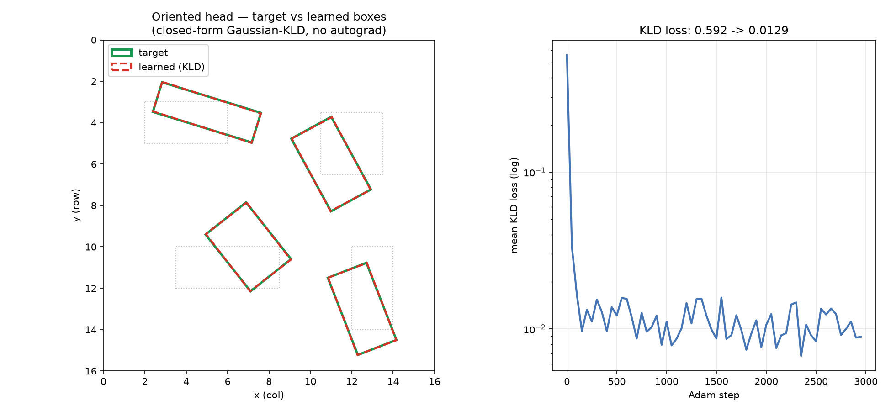

# SBSH Phase 3 — the oriented-bbox head

Date: 2026-07-13 · Mac (Apple Silicon) · Nagare at `ff0174f`+ · CPU · kato15 mirror synced `ff0174f` (137/0)

## Summary

The SBSH detector now has a **trainable oriented-bbox head**, closed-form and FD-verified, with **no
autograd**. The one genuinely new primitive is the loss:

- **`gaussian_kld`** (`src/ops/gaussian_kld.rs`) — an oriented box `(cx,cy,w,h,θ)` is modelled as a 2-D
  Gaussian `N(μ, Σ)`, `Σ = R(θ) diag((w/2)², (h/2)²) R(θ)ᵀ`, and the loss is the target-anchored
  Kullback–Leibler divergence wrapped in the bounded form `ℓ = 1 − 1/(τ + √D)`. Forward + a **hand-derived,
  finite-difference-verified backward** `∂ℓ/∂(cx,cy,w,h,θ)`.

The head glue is thin and composes existing ops:

- **`oriented_head`** (`src/ops/oriented_head.rs`) — `decode_forward/backward` (anchor-relative decode,
  `w,h` via `exp(·)` so strictly positive) and `assign_nodes` (a deterministic, gradient-free
  ground-truth→leaf-node assignment — the `cpml_tier` "structural ops carry no backward" discipline).

End to end: `field → quadtree_build (P1, structural) → node_pool (P1, diff) ⊕ oriented_descriptor (P2) →
linear → raw5 → decode(anchor) → gaussian_kld(target)`. The composed backward
(`features ← W ← decode ← gaussian_kld`) trains the per-node oriented boxes onto their targets under Adam —
loss **0.592 → 0.013** (Figure 1).

**No novelty is claimed for the loss.** The Gaussian-KLD oriented-box surrogate *is* Yang et al.: GWD
(ICML 2021, arXiv:2101.11952), KLD (NeurIPS 2021), KFIoU (ICLR 2022). What is Nagare-specific is (i) the
whole detection-head backward derived by hand and FD-verified (the no-autograd discipline), and (ii) its
composition on the quadtree + canonical-descriptor front-end. A Phase-0 novelty search (8 queries) confirmed
this positioning (see "Prior art").

## The op — math

`Σ = R diag(a,b) Rᵀ`, `a=(w/2)², b=(h/2)²`, so `|Σ| = ab` is **θ-independent** — which makes the whole
backward elementary 2×2 algebra:

```
D = KL(N_t ‖ N_p) = ½[ δᵀ Σ_p⁻¹ δ + tr(Σ_p⁻¹ Σ_t) + ln(|Σ_p|/|Σ_t|) − 2 ],   δ = μ_p − μ_t
ℓ = 1 − 1/(τ + √D)
```

Backward: `∂ℓ/∂p = (∂ℓ/∂D)·(∂D/∂p)`, with `∂ℓ/∂D = 1/(2√D(τ+√D)²)`, `∂D/∂μ_p = Σ_p⁻¹ δ`, and the shape
gradient from `G = ½[Σ_p⁻¹ − Σ_p⁻¹(Σ_t + δδᵀ)Σ_p⁻¹]` pushed through `Σ(a,b,θ)` and `a=(w/2)²`. All in f64
internally. Guards: half-axes clamped to `MIN_AXIS=1e-3` (invertibility for tiny boxes); `√D` floored by
`EPS_SQRT=1e-6` in the backward so the `1/√D` at the optimum stays finite (it multiplies a zero gradient —
verified).

## Two degeneracies the loss deliberately quotients out (found via the integration test)

The integration test (convergence to a target box) initially "failed" twice — both were the Gaussian model
behaving correctly, not a gradient bug. Recording them because they are load-bearing for anyone building on
this head:

1. **Square-object θ-degeneracy.** A square target (`w=h`) has an *isotropic* Gaussian (`Σ = a·I`), so θ is
   unidentifiable and the loss is genuinely θ-insensitive (`∂D/∂θ ∝ (a−b) → 0`). The first test target
   `(…,3,3,…)` left θ free (learned 0.878 vs "target" 1.2) while center/w/h matched tightly. This is the
   well-known square-object degeneracy KFIoU discusses — not a bug. Fix: keep all test targets elongated.
2. **Axis-swap ambiguity.** `(w,h,θ)` and `(h,w,θ±π/2)` describe the **identical** Gaussian
   (`R(θ)diag(a,b)Rᵀ = R(θ±π/2)diag(b,a)Rᵀ`). The head recovered `(w=2.0,h=4.0,θ=−0.36)` for the target
   `(w=4.0,h=2.0,θ=1.2)` — the axis-swapped equivalent (−0.36 ≈ 1.2 − π/2), with the loss at the floor. This
   invariance is a *documented feature* of the Gaussian OBB loss (it removes the angle-boundary
   discontinuity that plagues direct angle regression — a motivation of GWD/KLD).

Consequence for the test: the meaningful, ambiguity-free convergence certificate is the **loss reaching the
floor** plus recovery of the **center and the covariance Σ** — not the raw `(w,h,θ)` triple. The test asserts
`ℓ₁ < 0.02`, center within 0.2, and `|ΔΣ| < 0.15`. The same lesson as the Phase-2 kink artifact: *let the
measurement tell you what the op actually constrains.*

## Tests

| layer | test | result |
|---|---|---|
| unit (FD) | `gaussian_kld::backward_matches_fd` | ok — directional-derivative check, 5 params, tol 2% (passed first try) |
| unit | `gaussian_kld::zero_at_identity_and_positive_elsewhere` | ok — `ℓ=0 ⇔ p=t`; grad finite at the optimum; `D,ℓ>0` off it |
| unit | `gaussian_kld::pi_periodic_in_theta` | ok — `ℓ(θ)=ℓ(θ+π)` |
| unit | `gaussian_kld::tiny_box_stays_finite` | ok — `MIN_AXIS` clamp, no NaN |
| unit | `gaussian_kld::obox_roundtrips` | ok |
| unit (FD) | `oriented_head::decode_backward_matches_fd` | ok — anchor-relative decode backward |
| unit | `oriented_head::anchor_from_cell`, `assign_maps_center_to_leaf_and_dedups` | ok — structural assignment + dedup + out-of-image cull |
| integration | `oriented_head_learn::learns_oriented_boxes_through_kld` | ok — full head, loss 0.592→0.013, Σ + center recovered |
| full suite | `cargo test --release` | **137 passed / 0 failed** (+9) — Mac and kato15 |
| gate | `cargo fmt --check`, `cargo clippy --all-targets -D warnings` | clean |

## Figure



**Figure 1.** Left: four nodes, each with its quadtree anchor (grey dotted), ground-truth target (green) and
the box learned under the closed-form Gaussian-KLD loss (red dashed) — the learned boxes lie on the targets.
Right: mean KLD loss over 3000 Adam steps, `0.592 → 0.013` (log scale). Regenerate:
`cargo run --release --example oriented_head_demo -- reports/figures/oriented-head-boxes.json` then
`python scripts/dev/render_oriented_boxes.py …`.

## Files touched

| file | change |
|---|---|
| `src/ops/gaussian_kld.rs` | new op — `gaussian_kld_forward/backward`, `Obox`, `KldCache` + 5 tests |
| `src/ops/oriented_head.rs` | new glue — `decode_forward/backward`, `assign_nodes`, `anchor_of_cell`, `Anchor` + 3 tests |
| `src/ops/mod.rs`, `src/lib.rs` | register + re-export |
| `tests/oriented_head_learn.rs` | new integration (end-to-end KLD convergence) |
| `examples/oriented_head_demo.rs` | demo → JSON artifact for the figure |
| `scripts/dev/render_oriented_boxes.py` | renderer (target vs learned + loss curve) |

No new deps, no CORE.YAML. Plan bundle: `docs/plans/2026-07-13-sbsh-oriented-head/` (gitignored, PDF built).

## Prior art (Phase-0 novelty search, 8 queries — bounded, not exhaustive)

- **Loss (Claim 4): direct prior art — cite, do not claim novelty.** GWD (Yang et al., ICML 2021), KLD
  (Yang et al., NeurIPS 2021), KFIoU (Yang et al., ICLR 2022).
- **Descriptor front-end (Phase 2):** novel *composition*; must-cite RIFT, LIFT, classical Fourier
  descriptors, Singh & Singh orthogonal-moment equivariance.
- **Quadtree front-end (Phase 1):** novel *composition*; must-cite QuadTree-Attention (Tang et al., ICLR
  2022), BiFormer, SAG-ViT.
- **Closed-form FD-verified detection ops (Claim 1):** none found — FD grad-checking is standard practice,
  but no detector shipping the whole backward stack by hand was found. Weak "framing" novelty only.

Bounded search — "none found" ≠ proven novel; a targeted MMRotate/DOTA + remote-sensing-descriptor sweep is
warranted before any external novelty assertion.

## Performance

`n=1`, 4 nodes, 2×2 algebra — microseconds per op; the demo's 3000 Adam steps run in <0.4 s. Peak RSS
unchanged (no new buffers beyond the 5-vectors). No GPU. No perf regression (full suite wall unchanged).

## Caveats / open

- The head is single-image (`n=1`); batching is a later phase.
- No classification head, no NMS, no mAP benchmark yet — this phase is the *regression* head only.
- The square-object θ-degeneracy is inherent to the Gaussian model; a detector using this loss must resolve
  the axis convention downstream (long-edge / OpenCV convention) if it needs a canonical `(w,h,θ)`.

## Next (SBSH sequence)

- **Assemble the forward detector**: `quadtree_build → node_pool ⊕ oriented_descriptor → head`, run on the
  synthetic oriented-rect scene (from `examples/sbsh_tree_smoke.rs`), with a per-node objectness gate.
- **Objectness / classification head** (closed-form BCE — `bce_with_logits` already exists) + node→object
  assignment at eval (Hungarian or greedy-by-KLD).
- Then a small real oriented-detection slice (a DOTA/HRSC crop) once the forward path is FD-clean end to end.

## Provenance

- Mac (Apple Silicon), Nagare `ff0174f`+; CPU. No data, no GPU. Seeds: LinearLayer init seed 7 (demo/test).
- kato15 mirror synced to `ff0174f`, full suite 137/0 there.
- Reproduce: `cargo test --release gaussian_kld oriented_head` and `cargo test --release --test oriented_head_learn`.
