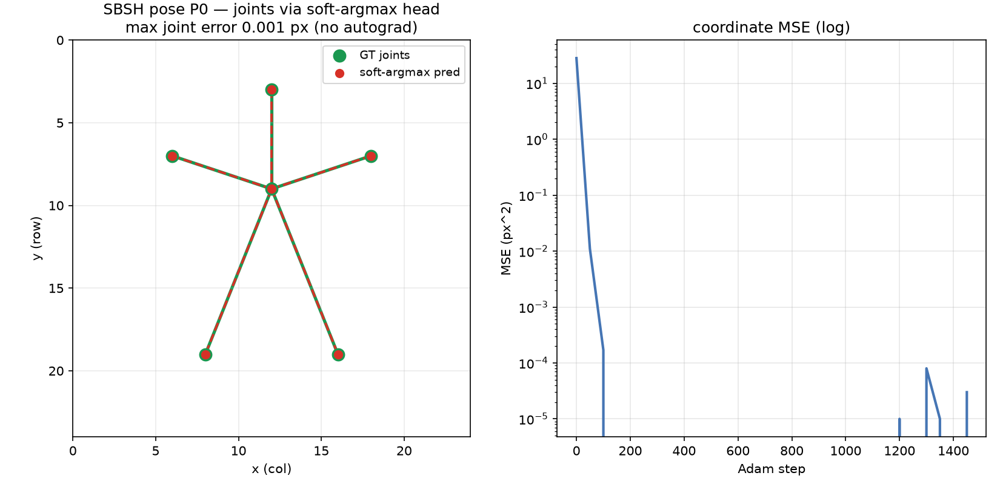

# SBSH Pose P0 — the soft-argmax keypoint head

Date: 2026-07-13 · Mac (Apple Silicon) · Nagare at `dd96f34`+ · CPU

## Summary

Opened the **pose detection & tracking** line on the signed-hypergraph-conv path, and landed its foundational
primitive: a **differentiable soft-argmax keypoint head** (`src/ops/soft_argmax.rs`), FD-verified, no autograd.
A per-joint heatmap → expected sub-pixel `(x,y)`. The P0 smoke fits a synthetic stick figure's joint
coordinates end to end through it — **max joint error 0.001 px** (Figure 1).

## The op — soft-argmax

Per joint, softmax over the `g×g` grid at temperature `τ` (max-subtracted, overflow-safe), then the expected
position:

```text
p_ij = softmax(s_ij / τ);   x̂ = Σ_ij p_ij·j,   ŷ = Σ_ij p_ij·i
```

**Backward** (softmax first-moment adjoint, hand-derived + FD-verified):
`s̄_ij = (p_ij/τ)·( x̄·(j − x̂) + ȳ·(i − ŷ) )`. Properties tested: a sharp peak → the argmax location; a flat
map → the grid centroid; translation-equivariant. **No novelty claimed** (integral pose regression, Sun et al.
ECCV 2018; DSNT, Nibali et al. 2018) — the contribution is the closed-form no-autograd op.

## Where it sits — the pose architecture (plan)

`docs/plans/2026-07-13-sbsh-pose/` frames the line:

- **Grid** — the dynamic quadtree (Phase 1) tessellates the frame; leaves = SBSH nodes.
- **Node features** — `oriented_descriptor` / `rotor_spike` per leaf.
- **Skeleton = signed hypergraph** — joints are nodes, **limbs are signed hyperedges** (sign = kinematic
  orientation / left-right). The `hg_message` kernels (now with the FD-verified sign gradients) do the signed
  conv, with the learnable **Chebyshev-CR (HSiKAN) basis** on the limb signs — the retained basis, the
  hg_conv path the user asked to develop.
- **Keypoint head** — each joint node emits a heatmap; **soft-argmax** (this op) reads off `(x,y)`.
- **Tracking (P2)** — the same signed hypergraph extended across frames via temporal hyperedges linking a
  joint at `t` and `t+1`.

## Tests

| layer | test | result |
|---|---|---|
| unit (FD) | `soft_argmax::backward_matches_fd` | ok — directional-derivative, 2%+abs-floor tol (near-zero pixels) |
| unit | `sharp_peak_recovers_argmax` | ok — sharp peak → peak location |
| unit | `flat_gives_centroid` | ok — flat heatmap → grid centroid |
| unit | `translation_equivariant` | ok — shifting the peak shifts the coordinate |
| integration | `examples/pose_smoke` | ok — 6-joint stick figure, MSE 28.3 → 0.00000, **max joint error 0.001 px** |
| full suite | `cargo test --release` | **151 passed / 0 failed** (+4) |
| gate | `cargo fmt --check`, `cargo clippy --all-targets -D warnings` | clean |

## Figure



**Figure 1.** Left: a 6-joint stick figure — GT joints/limbs (green) and the joints predicted through the
soft-argmax head (red) coincide (max error 0.001 px). Right: coordinate MSE `28.3 → ~1e-5` over 1500 Adam
steps. The full backward is `features ← W ← soft_argmax ← MSE`, all FD-verified closed-form ops.

## Files touched

| file | change |
|---|---|
| `src/ops/soft_argmax.rs` | new op — `soft_argmax_forward/backward`, `SoftArgmaxOut` + 4 tests |
| `src/ops/mod.rs`, `src/lib.rs` | register + re-export |
| `examples/pose_smoke.rs` | P0 smoke — stick-figure coordinate fit through soft-argmax |
| `scripts/dev/render_pose.py` | skeleton + predicted-joints figure |

No new deps, no CORE.YAML. Plan bundle: `docs/plans/2026-07-13-sbsh-pose/` (gitignored, PDF built).

## Next (pose sequence)

- **P1** — the full forward pose net: `quadtree grid → per-node feats → signed hg_conv over the skeleton (CR
  basis on limb signs) → per-joint heatmap → soft_argmax`, on a rendered stick-figure scene; a limb-consistency
  loss (the signed-hypergraph structure) alongside the coordinate MSE.
- **P2** — temporal tracking: extend the skeletal hypergraph across frames.
- **Phase 0** — pose-literature novelty search before any external claim (soft-argmax and PAF are prior art;
  the *composition* on a signed-hypergraph-conv over the SBSH adaptive grid is what to position).

## Provenance

- Mac (Apple Silicon), Nagare `dd96f34`+; CPU. No data (analytic stick figure). Seeds: head init 7.
- Reproduce: `cargo test --release soft_argmax` and `cargo run --release --example pose_smoke`.
