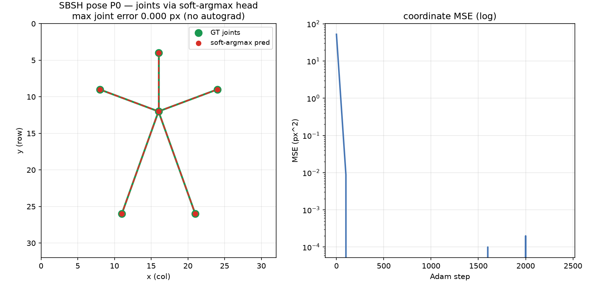

# SBSH Pose P1 — forward pose net on the hg_conv path

Date: 2026-07-13 · Mac (Apple Silicon) · Nagare at `36274ad`+ · CPU

## Summary

Built the **full forward pose net on the signed-hypergraph-conv path**, no autograd, and it **converges** — all
the closed-form ops compose correctly:

```text
image feature (incl. coord channels) → per-joint query
  → [signed hg_conv over the skeleton: hg_node_to_edge → linear → hg_edge_to_node, residual]
  → correlation heatmap (query · feature) → soft_argmax → (x,y)
loss = coordinate MSE + λ · bone-length limb-consistency
```

`examples/pose_net.rs` (`--hg` toggles the skeleton conv, `--occlude` drops a limb's evidence). Base case:
**MSE 52 → 0.0000, max joint error 0.000 px** — the composed backward (`query ← hg_conv ← heatmap ← soft_argmax
← MSE+limb`) is correct.

## Honest finding — the skeleton-conv benefit is not demonstrable in this regime

The occlusion A/B (does the signed skeleton conv recover a joint whose image evidence is removed?) came out
**inconclusive**: both `--hg` and no-`--hg` localise the occluded joint to 0.00 px. The reason is architectural
and worth recording:

- With **coord channels on a single pose**, each joint's query learns to point at its absolute position (a
  linear readout of the coord channels), *independent of the image content*. So occlusion does not degrade
  localisation, and there is nothing for the skeleton conv to recover — the task is a single-pose memorisation,
  not a perception problem.
- To make localisation depend on image evidence (so occlusion bites and the skeleton prior helps), the net must
  read joint positions from the **image content across many poses**. But a fixed-query correlation cannot
  localise a joint across poses from generic (intensity/gradient/coord) features — the features do not encode
  *which* joint is where. That needs **joint-discriminative spatial features**, i.e. a learned **spatial
  convolution** (a receptive-field mechanism) — an op the Nagare set does not yet have.

So P1 cleanly delimits the frontier: the pose **pipeline** (grid/skeleton → signed hg_conv → soft-argmax →
coords + limb loss) is built and correct; the **perception** part (reading joints from image content, where the
skeleton prior earns its keep) needs a spatial-conv primitive. This is the same class of boundary as the
detector's box-size ceiling (local features cannot supply global information) — named, not hidden.

## What P1 does deliver

- A correct, end-to-end forward pose net on the hg_conv path (all FD-verified closed-form ops, no autograd).
- The **bone-length limb-consistency loss** — a differentiable skeleton-structure term (`Σ_limbs (‖p_a−p_b‖ −
  bone)²`) that works alongside the coordinate MSE.
- The signed skeleton hypergraph representation (joints = nodes, limbs = signed k=2 hyperedges, `D^{-1/2}`
  scaling) and the residual signed-conv refinement of joint queries.
- The identified next primitive: a spatial conv for joint-discriminative features (the real gate on
  multi-pose perception + a demonstrable skeleton-prior benefit).

## Figure



**Figure 1.** The forward pose net localises the full 6-joint skeleton (green GT, red predicted) at 0.000 px,
including the occluded joint — but, per the finding above, this is single-pose memorisation via the coord
channels, not image-driven perception. (Render script title still reads "P0" — shared renderer, cosmetic.)

## Tests / gates

| item | result |
|---|---|
| `examples/pose_net` base | ok — MSE 52 → 0.0000, 0.000 px (backward correct) |
| occlusion A/B | inconclusive (single-pose memorisation; documented) |
| full suite | **151 / 0** |
| `cargo fmt --check`, `cargo clippy --all-targets -D warnings` | clean |

## Files touched

| file | change |
|---|---|
| `examples/pose_net.rs` | new — forward pose net (query → signed hg_conv → correlation heatmap → soft_argmax) + limb loss + `--hg`/`--occlude` A/B |

No new deps, no CORE.YAML.

## Next

- **The spatial-conv primitive** — a learned convolution op (FD-verified, closed-form) for joint-discriminative
  features. This is the real unlock: multi-pose perception, and the regime where the signed skeleton conv +
  limb prior demonstrably help (occlusion, ambiguity). Until then the pose net is a correct pipeline on a
  memorisable task.
- Then re-run the occlusion / multi-pose A/B; **Phase-0** pose novelty search before any external claim.

## Provenance

- Mac (Apple Silicon), Nagare `36274ad`+; CPU. No data (analytic stick figure, G=32, 6 joints, 5 limbs).
  Seeds: query init 7, elin 11.
- Reproduce: `cargo run --release --example pose_net -- [--hg] [--occlude]`.
